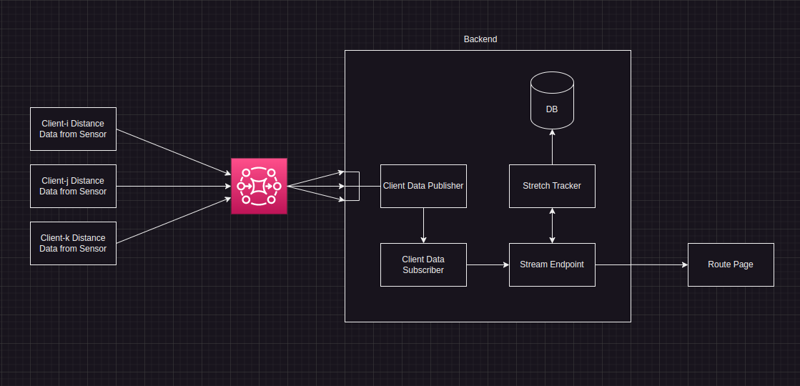

# move-simulator

A fun-project made to work with my distance-tracker. A sensor or device provides data about how much distance has been covered. No additional information like latitude or longitude are provided because the sensor won't have a GPS with it. This simulator inetgrates with the sensor, takes a desired start and stop point from user and shows live update based on sensor reading on the path from start to stop point in a map.

# Design

The system requires following data to be successful:
1. [Start-Stop Coordinates](#start-stop-coordinates)
1. [Route Coordinates](#route-coordinates)

## Start-Stop Coordinates

Start and stop coordinates provides latitude and longitude of beginning and destination. As latitude and longitude are not intuitive, coordinates are derived from start and destination address. To achieve this, [reverse-geocoding](https://github.com/mosteligible/reverse-geocoding) has been used.

## Route Coordinates

The latitude and longitude of route from start to stop coordinates are calculated with the help of [routing-engine](https://github.com/mosteligible/routing-engine). Routing engine provides the best path to take from start to stop coordinate in form of latitude and longitude coordinates.

## Implementation Overview

The implementation will work as shown in the diagram below:



# Starting the system

As of now, a utility method imitates the sensor reading. This is used as input to calculate next coordinates in every stretch of route, from starting point to end.

**WIP:**
- Setup with Rabbitmq to read sensor readings

## To Start the system:

Docker compose yaml file has all the requirements to run the application locally, provided that docker is installed in the machine. It will provide with initialized database, routing engine and reverse-geocoder.

In order to initialize the application, `db.env`, `revgeocode.env` and `simulator.env` should be created from templates provided in the root directory and they are named as `db.env.template`, `revgeocode.env.template` and `simulator.env.template` respectively.

### `db.env`

Default postgres datbase is listening on port `5432` so the tempalte provides the value as default but it can be changed based on requirement.
- `PGRES_USERNAME` will be username for simulator app to access db.
- `PGRES_USER_PASSWORD` will be password for simulator app to authenticate against db.
- `POSTGRES_DB` is name of database where `user` and `routes` tables will be created.
- `POSTGRES_USER` is root username of database.
- `POSTGRES_PASSWORD` is password for root user.
- `PGRES_DB_HOST` is the host address for postgres database (optional for now).

### `simulator.env`

Variables in here should be named same as `db.env` because they are inter-related.

### `revgeocode.env`

It contains the location to downloaded `osm.pbf` file that is mapped into reverse-geocoder docker image

### Start Process

```
export $(cat db.env)
make docker-compose
```

- Goto `localhost:5000/register`
- Create a user
- Add Route
- Start simulation (It uses dummy data with python's `random` library, until rabbitmq consumption is added).
